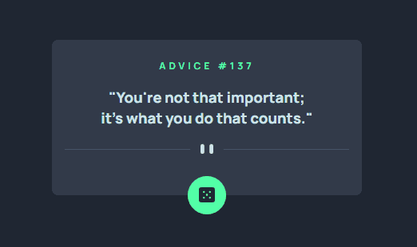

# Projeto gerador de conselhos aleatório

Um projeto de quest do curso DevemDobro DevQuest🚀🚀🚀

🎈 Objeto do projeto: Criar mensagens aleatórias quando o usuário clica no botão e é gerado as mensagens.

🎈 Resultado do projeto

## 🚩Passos que foram feitos para a criação do projeto:

1. Adicionado o elemento de  **botão** para ser adicionado o **evento de clique** nele;

2. Adicionado o elemento de **id do conselho**;

3. Adicionado o elemento de **descrição do conselho**;

4. Após colocarmos os elementos do html,  foi criado uma **função responsável por pegar os dados da API**.  A melhor forma de se consumir a api é usando **async await**;

5. Dentro da função, após colocarmos os dados da API, é necessário atualizar o conteúdo do id e descrição do conselho que colocamos em uma variável usando o **innerHTML**;

6. Por fim, basta chamar a função criada;

7. Atribuir a função que criamos para ser executada no evento do clique do botão.

✅Liguagens que foram usadas.

- CSS
- HTML
- JavaScript

✅API de uso para gerador de mensagens aleatória
- https://api.adviceslip.com/advice

👊🏻🤘🏻 Desafios que tive🤘🏻👊🏻

Foi um pouco desafiador para montar este projeto pois eu comecei a trabalhar com API recentemente e tinha acabado de concluir meu conhecimento em JS avançado, mas, foi incrível a experiência de poder  construir e me desafiar a melhorar minhas expertises em programação.

